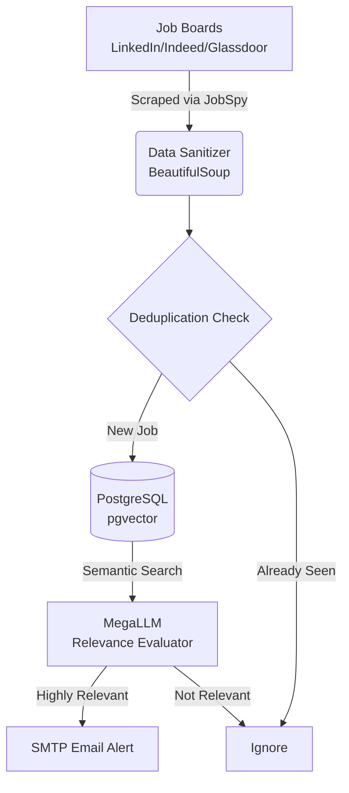

<div align="center">
  <h1>🚀 Autonomous AI Job Alert Agent</h1>
  <p><b>A highly scalable, continuous monitoring agent that leverages LLMs and Vector Databases to find your perfect job.</b></p>
  <br/>
</div>

## 📖 Overview

The **Autonomous AI Job Alert Agent** is a production-grade Python tool designed to automate your job search. Instead of manually checking LinkedIn or Indeed every day, this agent sits in the background, continuously scrapes multiple job boards, evaluates descriptions using advanced semantic search and Large Language Models, and emails you beautifully formatted alerts the moment a matching job is found.

## ✨ Core Features

*   **🌐 Universal Multi-Portal Scraping:** Seamlessly pulls live job data from **LinkedIn, Indeed, Glassdoor**, and ZipRecruiter simultaneously without getting blocked by anti-bot systems.
*   **🧠 Semantic Vector Search:** Uses `sentence-transformers` and PostgreSQL (`pgvector`) to map job descriptions against your resume/skills in an embedding space, instantly finding jobs with the highest contextual match.
*   **🤖 MegaLLM Agentic Evaluation:** Instead of relying on dumb keyword matching, it passes the top candidates to an AI evaluator (MegaLLM) to read the description and make a human-like judgment on its relevance.
*   **🧹 Data Sanitization:** Automatically cleans messy, scraped HTML using `BeautifulSoup` to ensure accurate AI evaluation.
*   **📧 Modern HTML Email Alerts:** Delivers highly relevant job opportunities straight to your inbox with direct "Apply Now" links.
*   **🕰️ 24/7 Background Scheduler:** Run the agent as a continuous daemon that wakes up every X minutes/hours, ensuring you are always the first to apply to new openings.

---

## 🏗️ Architecture Flow



---

## 🛠️ Prerequisites

Before installing, ensure you have the following ready:
*   **Python 3.10+** installed on your system.
*   **PostgreSQL** installed and running locally (or remotely).
*   **pgvector** extension installed on your Postgres database.
*   **MegaLLM API Key** (OpenAI-compatible LLM provider).
*   **Gmail App Password** (A 16-character password to allow the script to send emails).

---

## 🚀 Installation

**1. Clone the repository and navigate into it:**
```bash
git clone https://github.com/<YOUR-USERNAME>/Job-Alert-Agent.git
cd Job-Alert-Agent
```

**2. Create and activate a virtual environment:**
```bash
# Windows
python -m venv venv
venv\Scripts\activate

# Mac/Linux
python3 -m venv venv
source venv/bin/activate
```

**3. Install dependencies:**
```bash
pip install -r requirements.txt
```

---

## ⚙️ Configuration

**1. Environment Variables (`.env`)**  
Copy the example environment file and fill in your private credentials:
```bash
cp config/.env.example config/.env
```
Inside `.env`, provide your Postgres connection URL, your MegaLLM API Key, and your email credentials. *Note: Never commit your `.env` file to version control.*

**2. Search Preferences (`config.yaml`)**  
Open `config/config.yaml` to define your dream job. The agent will adapt to whatever you put here:
```yaml
preferences:
  role: "Frontend Developer"
  location: "India"
  experience: "fresher"
  skills:
    - react
    - javascript
    - typescript
```

---

## 🏃‍♂️ Usage

You can run the agent in two different modes depending on your workflow:

### Mode 1: Single Ad-Hoc Run
Use this to run the pipeline exactly once. Perfect for testing your configuration, verifying your email setup, or running a quick manual search.
```bash
python examples/run_agent.py
```

### Mode 2: Continuous Background Daemon
Use this to turn your machine into a 24/7 job monitoring server. The script will sit quietly in the terminal, wake up at your defined interval (e.g., every 5 minutes), scrape the internet, evaluate new jobs, email you, and go back to sleep.
```bash
python examples/run_scheduler.py
```
*(To change the interval, open `examples/run_scheduler.py` and modify the `schedule.every(5).minutes.do(job)` line).*

---

## 📂 Project Structure

```text
Job-Alert-Agent/
├── agents/             # Core logic for state-machine orchestration and LLM evaluation
├── config/             # YAML configurations and centralized settings
├── examples/           # Entrypoint scripts (run_agent, run_scheduler)
├── tests/              # Pytest unit tests for pipeline validation
├── tools/              # External integrations (Database, Scraper, Email, Embeddings)
└── utils/              # Helper functions (Logging, Deduplication Hashes)
```

## 🤝 Contributing
Pull requests are welcome! If you'd like to add support for a new LLM provider, a new vector database, or improve the HTML email templates, feel free to fork the repository and submit a PR.
